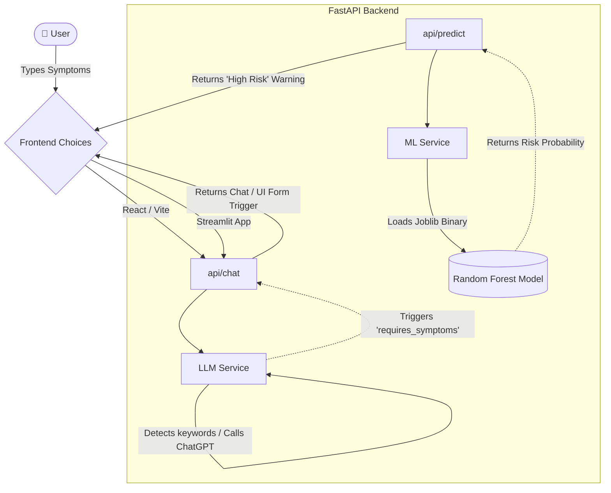

<h1 align="center">
  ⚕️ AI Healthcare Assistant & Disease Prediction System
</h1>

<p align="center">
  <em>A Complete, Modern, High-End AI Healthcare Assistant featuring natural conversational flow powered by LLMs and an embedded Machine Learning pipeline for Heart Disease Risk Assessment.</em>
</p>

<p align="center">
  <strong>👑 Created & Developed by: devcrazy AKA Abhay Goyal</strong>
</p>

<p align="center">
  
  
  
  
  
</p>

---

## 🌟 Overview

The **AI Healthcare Assistant** revolutionizes standard rule-based medical chatbots. By integrating a dynamic conversational LLM, it converses naturally to understand context. If it detects critical symptoms (like *chest pain* or *high blood pressure*), it seamlessly interfaces with an embedded **Machine Learning (Random Forest)** model to predict precise medical risk probabilities.

### ✨ Key Features
- **🧠 Natural LLM Conversations:** Maintains conversation turn-history and responds using OpenAI (or a highly robust mock intent analyzer).
- **🫀 Live ML Disease Risk Assessment:** Evaluates raw clinical inputs (age, cholesterol, max heart rate, etc.) directly into a trained Scikit-Learn Random Forest Classifier.
- **🎨 Glassmorphism React Frontend:** A heavily stylized, breathtaking React/Vite UI featuring frosted glass, CSS animations, and dynamic chat bubbles.
- **🐍 Alternative Streamlit Frontend:** A lightning-fast, Pure-Python web-app alternative perfect for rapid data-science deployment!
- **⚡ Async FastAPI Backend:** Highly performant, modular Microservices backend.

---

## 🏗️ Architecture & Flow

The system runs on decoupled microservices to ensure rapid scalability. 



---

## 🚀 Quick Setup Guide

### 1. The Backend (Required Core Engine)
Because this hosts the Machine Learning models and APIs, it must be running.

```bash
# 1. Install all dependencies
pip install pandas scikit-learn fastapi uvicorn python-multipart openai pydantic pydantic-settings python-dotenv joblib streamlit

# 2. Enter the backend directory
cd backend

# 3. Boot up the Lightning-Fast Uvicorn Server!
python -m uvicorn main:app --reload
```
*The API is now running locally on `http://127.0.0.1:8000`. Keep this terminal window open!*

### 2. Choose Your Frontend

You don't need both! Pick the frontend that works best for your environment.

#### Option A: Streamlit (Recommended for Instant Python Deployment)
*Zero JavaScript required!* Open a new terminal and run:
   ```bash
   # Run the Python Web App
   python -m streamlit run frontend_streamlit\app.py
   ```

#### Option B: React + Vite (Advanced High-End Interface)
*Requires Node.js to be installed.* Open a new terminal and run:
   ```bash
   cd frontend
   npm install        # Downloads Node modules
   npm run dev        # Boots the Webpack/Vite Server
   ```

---

## 🤖 Adding OpenAI (Optional)
If you want the Chatbot to act as an incredibly intelligent generative agent instead of just triggering rules, you can add an API Key!
1. In the `backend` folder, create a new file specifically named `.env`
2. Add your key inside: `OPENAI_API_KEY=sk-your-super-secret-key`
3. Restart your backend terminal. The bot is now alive!

---

## 📁 Repository Structure
```text
Health-Care-Chatbot-main/
│
├── backend/            # FastAPI Microservices Backend
│   ├── api/            # API Routers (chat, predict, history)
│   ├── services/       # Core Logic (LLM Context, ML Predictor)
│   ├── ml_models/      # Compiled Model Binaries (.joblib)
│   └── main.py         
│
├── frontend/           # High-End React.js + Vite Web Application
├── frontend_streamlit/ # Pure Python alternative Web Application
├── notebooks/          # ML Training Scripts & Data Analysis
├── data/               # Source Datasets (heart-disease.csv)
├── legacy/             # Original Tkinter Archive (Safely Archived)
└── README.md           # You are here!
```

---

### ©️ License & Ownership
**MIT License** 
Copyright (c) 2026 devcrazy AKA Abhay Goyal. 
See the `LICENSE` file for more details.

> **Disclaimer:** Built for educational purposes by Abhay Goyal. Always consult a certified healthcare professional before making actual medical decisions.
